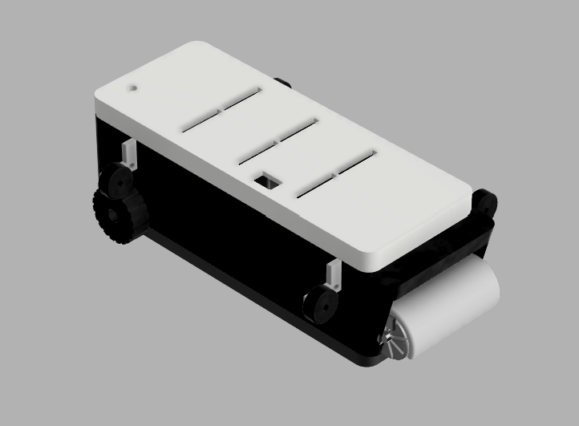

# Baseboard Cleaning Robot

A parametric CAD model of an autonomous baseboard-cleaning robot, designed end to end in Autodesk Fusion 360 — 15 components, driven from a single document-level parameter table.

**[→ View the full project page](https://YOUR-USERNAME.github.io/baseboard-cleaner-robot/)**



## Overview

The device travels along a wall using a rotating brush to sweep debris out of the baseboard seam, guided by four free-spinning side wheels. The project page covers the design intent, the engineering decisions made along the way, and what's deliberately simplified for a portfolio build rather than a manufacturing-ready one.

## Repo structure

```
.
├── index.html              # Project showcase page (GitHub Pages)
└── assets/
    ├── renders/
    │   ├── isometric.png
    │   ├── front.png
    │   └── exploded.png
    ├── drawings/
    │   └── Baseboard_Cleaner_Drawing.pdf
    └── bom.csv              # Bill of materials
```

## Specs

| | |
|---|---|
| Overall dimensions | 220 × 85 × 65 mm |
| Drive wheel | ⌀35 mm |
| Brush core | ⌀28 × 70 mm |
| Components modeled | 15 |
| Software | Autodesk Fusion 360 |

## Bill of materials

See [`assets/bom.csv`](assets/bom.csv) for the full 15-line BOM, covering both modeled parts and off-the-shelf components (motor, battery cells, screws).

## License

Personal portfolio project, shared for review purposes.
